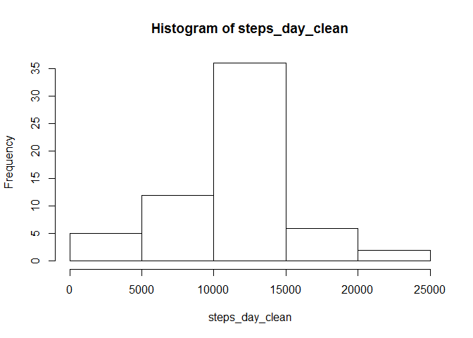

# Reproducible Research: Peer Assessment 1


## Loading and preprocessing the data

The dataset is loaded from file "activity.csv" which should be in your R working directory (either copy file to your working directory, or change working directory to the location of the file). There should be 17568 observations in the dataset.


```r
activity <- read.csv("activity.csv")
str(activity)
```

```
## 'data.frame':	17568 obs. of  3 variables:
##  $ steps   : int  NA NA NA NA NA NA NA NA NA NA ...
##  $ date    : Factor w/ 61 levels "2012-10-01","2012-10-02",..: 1 1 1 1 1 1 1 1 1 1 ...
##  $ interval: int  0 5 10 15 20 25 30 35 40 45 ...
```


## What is mean total number of steps taken per day?

For this part we will ignore missing values. 
We will calculate total number of steps per day using tapply function:

```r
steps_day <- tapply(activity$steps, activity$date, sum, na.rm = TRUE)
```

From the resulting data we will create histogram using R base plot:

```r
hist(steps_day)
```

<!-- -->

The mean and median of the total number of steps taken per day.

```r
mean(steps_day, na.rm = TRUE)
```

```
## [1] 9354.23
```

```r
median(steps_day, na.rm = TRUE)
```

```
## [1] 10395
```


## What is the average daily activity pattern?

We will calculate average number of steps per 5-minute interval, and plot time series plot of that data.

```r
steps_interval <- tapply(activity$steps, activity$interval, sum, na.rm = TRUE)
plot(rownames(steps_interval), steps_interval, xlab = "5 minute interval", ylab = "average number of steps", type = "l")
```

<!-- -->

Interval for which we observe maximum number of steps (which is also shown), averaged across all days.

```r
steps_interval[steps_interval == max(steps_interval)]
```

```
##   835 
## 10927
```


## Imputing missing values

Total number of rows with missing values (coded as NA):

```r
sum(is.na(activity))
```

```
## [1] 2304
```

We will replace missing values with mean values (rounded) for that 5 minute interval. First we need to obtain mean values for each 5-minute interval

```r
mean_interval <- round(tapply(activity$steps, activity$interval, mean, na.rm = TRUE))
```

Then we will create new dataset, and replace missing values with corresponding calculated mean values in the new dataset, keeping the original old dataset in case we will need it:

```r
activity_clean <- activity
activity_clean[is.na(activity), "steps"] <- mean_interval[as.factor(activity_clean[is.na(activity), "interval"])]
```

Check if there are missing values now:

```r
sum(is.na(activity_clean))
```

```
## [1] 0
```

Showing histogram, and mean and median values, calculated from dataset without missing values:

```r
steps_day_clean <- tapply(activity_clean$steps, activity_clean$date, sum)
hist(steps_day_clean)
```

<!-- -->

```r
mean(steps_day_clean)
```

```
## [1] 10765.64
```

```r
median(steps_day_clean)
```

```
## [1] 10762
```


## Are there differences in activity patterns between weekdays and weekends?

We will create new variable which indicates if the given day is weekday or weekend day.
First we will create a vector of factor variable from the dataset, than add that vector as a column to clean dataset. We will use
POSIX numerical representation of days to avoid problems with different locale settings.

```r
posixDays <- as.POSIXlt(activity_clean$date)$wday
activity_clean$weekday <- as.factor(ifelse(posixDays > 0 & posixDays < 6, "weekday", "weekend"))
```

Time series plot for weekdays:

```r
steps_weekday <- with(activity_clean[activity_clean$weekday == "weekday", ], tapply(steps, interval, mean))
plot(rownames(steps_weekday), steps_weekday, xlab = "5 minute interval", ylab = "average number of steps", type = "l", main = "Weekdays activity")
```

<!-- -->

Time series plot for weekends:

```r
steps_weekend <- with(activity_clean[activity_clean$weekday == "weekend", ], tapply(steps, interval, mean))
plot(rownames(steps_weekend), steps_weekend, xlab = "5 minute interval", ylab = "average number of steps", type = "l", main = "Weekends activity")
```

<!-- -->
